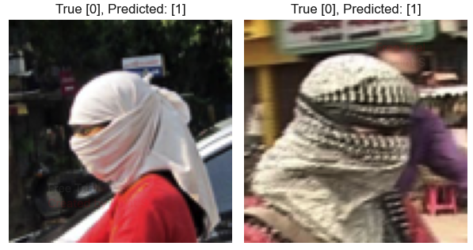
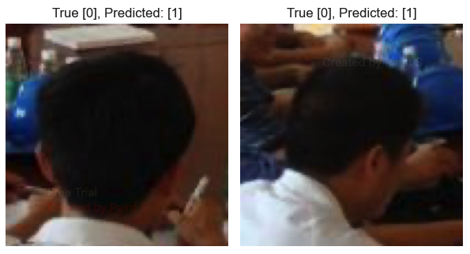

## Description: 
  Four CNN classifiers trained separately on Dataset0 (classification), Dataset1
  (classification), Dataset2 (bounding-box → crops), and Dataset3 (bounding-box
  → crops). Models evaluated on holdout sets from Dataset2 and Dataset3 to
  measure cross-dataset generalization. Preprocessing included resizing
  classification images to 200x200 and cropping bounding-box features to 100x100
  after removing features smaller than 50x50.

# Project: Model Cross-Data Validation Purpose

* Compare the performance of four helmet-detection CNNs trained on different datasets using holdout data from the second two datasets for testing.
* Demonstrate how dataset quality and preprocessing choices affect final model performance.

## Datasets

In this project each of the four models was trained off an initial dataset, and the result of each model was tested on a cross-validation dataset with holdout data from Dataset2, and Dataset3.

Training notebooks: [Helmet_CNN_Model_Training_Notebooks](https://github.com/DanielLevenstein/Helmet_CNN_Model_Training_Notebooks)
| Dataset  | Source                                                                                                                          | Datasets Type  | Samples Used | Model Accuracy |
| -------- | ------------------------------------------------------------------------------------------------------------------------------- | -------------- | ------------ | -------------- |
| Dataset0 | Great Learning:[HelmNet_ImageProcessing_Notebook](https://github.com/DanielLevenstein/HelmNet_ImageProcessing_UT_ML_Project6/)  | Classification | ~600         | ~76%           |
| Dataset1 | Kaggle:[on-vehicle-helmet-detection-dataset](https://www.kaggle.com/datasets/rajeevsekar21/on-vehicle-helmet-detection-dataset) | Classification | ~500         | ~70%           |
| Dataset2 | Kaggle:[helmet-detection](https://www.kaggle.com/datasets/andrewmvd/helmet-detection)                                           | Bounding Boxes | ~250         | ~93%           |
| Dataset3 | Kaggle:[hard-hat-detection](https://www.kaggle.com/datasets/andrewmvd/hard-hat-detection)                                       | Bounding Boxes | ~3000        | ~93%           |

**This table shows the source of each dataset used the dataset type and the number of sample features used after preprocessing.**
**Model Accuracy was calculated based on a holdout dataset from Dataset2, and Dataset3.**

## Streamlit App

This streamlit app was inspired by a model I built for a school project at UT that performed really well on training data but poorly on real-world data.

[Live Streamlit Demo](https://huggingface.co/spaces/DanielLevenstein/Helmet_Image_Classification)

### Model Parameters
Model0 and Model1 both take a 200x200 image as their input image, and model2 and model3 take a 100x100 input image.
Because these datasets were generated differently, they aren't directly comparable.
 Uploaded images are resized prior to evaluation. 

## Preprocessing

* Classification datasets (Dataset0, Dataset1)
  * All images resized to 200×200 pixels prior to training.
* Detection datasets (Dataset2, Dataset3)
  * Each bounding box is processed to create training crops.
  * Features smaller than 50x50 pixels are removed from the dataset to ensure high-quality training data.
  * For each remaining feature a 100×100 pixel image was saved with the object's center positioned as close as possible to the crop center as possible.
* Holdout
  * A holdout set was extracted from Dataset2 and Dataset3 and saved prior to any training; used only for cross-model validation.
  * The final validation set consisted of 50 images taken from each of these holdout sets.
  * Due to the small sample size of Dataset2, it was not possible to create a larger final validation set.

## Validation

* All four models are evaluated based on from a hold-out dataset from Dataset2, and Dataset3.
* Because Dataset2 is significantly smaller than Dataset3, a sample of 50 images was taken from each holdout set for evaluation.
* When evaluating Model0 and Model1, the validation data is resized to 200x200 prior to evaluation.

### Data Leakage

* To prevent data leakage, the dataset directories are being wiped clean between runs so training data can't accidentally end up in the final testing dataset.

# Final Results

Model3 performed the best overall on both the cross-validation test suite and the internal test validation test suite.

- The accuracy of Model3 was ~97 on the initial testing dataset and ~93 on the cross-validation dataset.
- The accuracy of Model2 jumped from ~85% to ~93% between the initial testing dataset and the cross-validation dataset.
- Conversely, the accuracy of Model1 dropped from ~97% to ~70% between the initial test run and the cross-validation test run.

Both of these results can be explained by differences in the quality of the data between datasets.

## Misclassified Images

- Dataset2 misclassified images involving individuals wearing headcoverings as containing helmets when they did not.

  
- Dataset3 misclassified images include images which included helmets in the background.

  

## Cross-Validation Results

| Model  | Accuracy | Precision |   Recall | F1-Score |
| :----- | -------: | --------: | -------: | -------: |
| Model3 |     0.93 |  0.955056 | 0.965909 | 0.960452 |
| Model2 |     0.93 |  0.926316 | 1.000000 | 0.961749 |
| Model1 |     0.70 |  0.983333 | 0.670455 | 0.797297 |
| Model0 |     0.76 |  0.890244 | 0.829545 | 0.858824 |

## Conclusion

The performance of Model2 and Model3 were close. Model3 had the highest precision, whereas the F1 scores and accuracy scores were tied between the two models.

After the validation data was normalized, the performance of Model0 improved enough to surpass Model1 on all metrics.
This was surprising given how limited the no-helmet class was in this dataset. Model1 consisted of only two individuals
and was taken by hand, but on initial inspection still felt like a higher-quality dataset than Dataset0.

Dataset origins and preprocessing steps played crucial roles in final model performance. Dataset0 originated from an
internal UT project, whereas Datasets1 through Dataset3 were publicly available Kaggle datasets. Consistent resizing and cropping
across datasets were key to reducing input-size variation and isolating dataset-quality effects.
